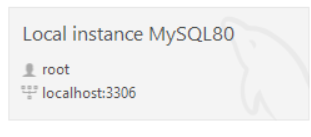

# restaurant-reservation-backend

# Proyecto FastAPI

Este es un proyecto backend hecho con FastAPI. A continuación, se describen los pasos para configurar el entorno, instalar las dependencias y ejecutar el proyecto.

## Requisitos Previos

- Python >= 3
- pip (gestor de paquetes de Python)

## Estructura del Proyecto

A continuación se muestra la estructura de carpetas y archivos del proyecto:

```
restaurant-reservation-backend/
│
├── app/
│   ├── crud.py
│   ├── database.py
│   ├── main.py
│   ├── models.py
│   ├── schemas.py
│
├── venv/                  # Directorio del entorno virtual (ignorado por git)
├── .env                   # Variables de entorno (ignorado por git)
├── .gitignore
├── requirements.txt
└── README.md

```

## Configuración del Entorno Virtual

1. Clona el repositorio:
   https://github.com/SantiagoRicardo/restaurant-reservation-backend.git

2. Crea un entorno virtual: `python -m venv venv` sino funciona con este intentar con python3 ...

3. Activa el entorno virtual:

- En Windows:

  ```
  venv/Scripts/activate
  ```

- En macOS y Linux:

  ```
  source venv/bin/activate
  ```

4. Instalar las dependencias:`pip install -r requirements.txt` desde la raíz del proyecto.

## Configuración de Variables de Entorno

Crea un archivo `.env` en el directorio raíz del proyecto con las siguientes variables, por ejemplo:

```
MYSQL_HOST=127.0.0.1
MYSQL_USER=root
MYSQL_PASSWORD=Ricar555@        #[Su ontraseña]
MYSQL_PORT=3306
MYSQL_DATABASE=restaurant_reservations
```

Estos datos del HOST(es el mismo localhost), PORT(el que se sitúa al lado del localhost) USER
los puede encontrar en worbench:



## Ejecución del Proyecto

Con el entorno virtual activado y las dependencias instaladas, iniciamos la aplicación desde la raiz de `/App`:

`uvicorn app.main:app --reload`

### Archivo `.gitignore`

Asegúrarse de que el archivo `.gitignore` incluya el directorio del entorno virtual: `venv/ .env`

## Descripción de los Archivos Principales

### `app/database.py`

Contiene la configuración de la conexión a la base de datos utilizando variables de entorno.

### `app/models.py`

Define los modelos de datos de la aplicación.

### `app/crud.py`

Contiene las operaciones CRUD (Crear, Leer, Actualizar, Eliminar) para la base de datos.

### `app/schemas.py`

Define los esquemas de datos para las solicitudes y respuestas utilizando Pydantic.

### `app/main.py`

Punto de entrada de la aplicación FastAPI. Define las rutas y los controladores de la API.

Listo!
